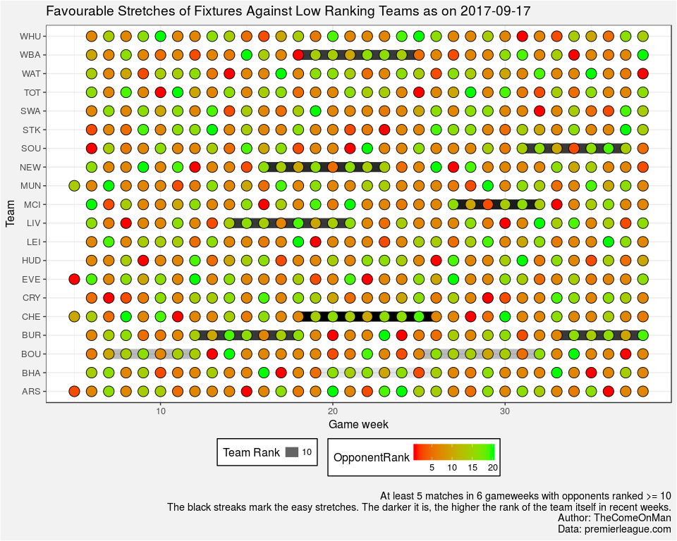
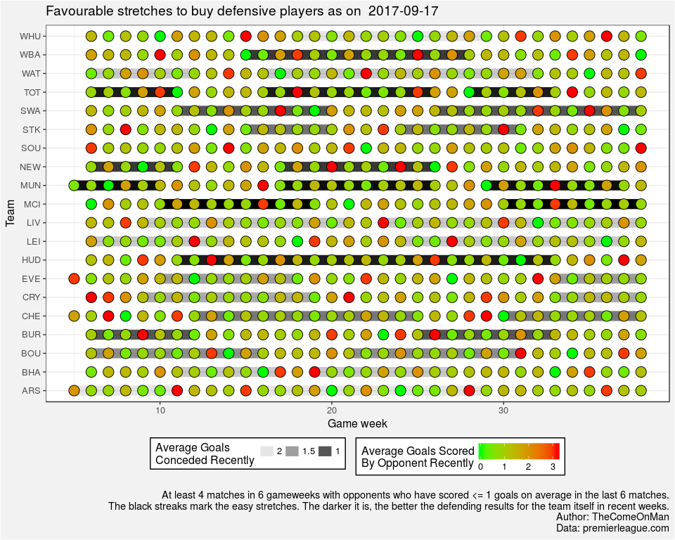
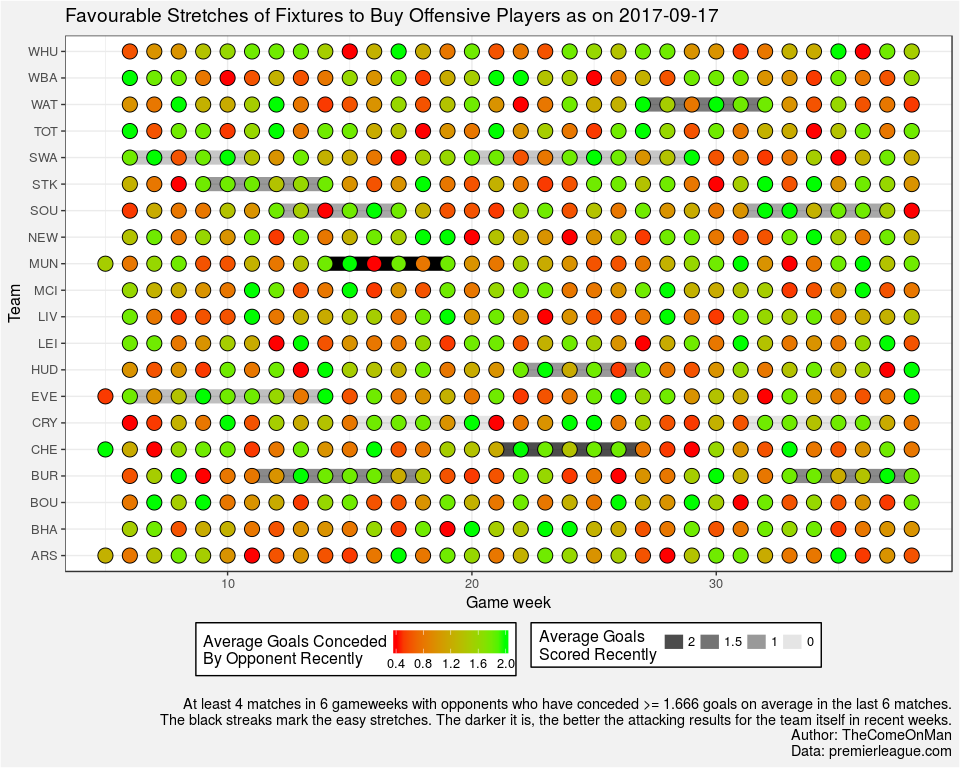
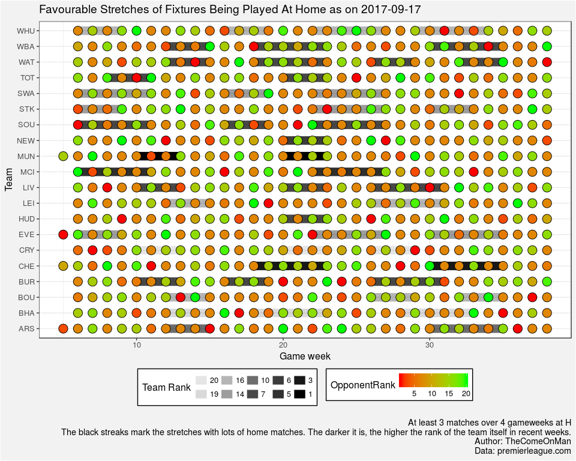
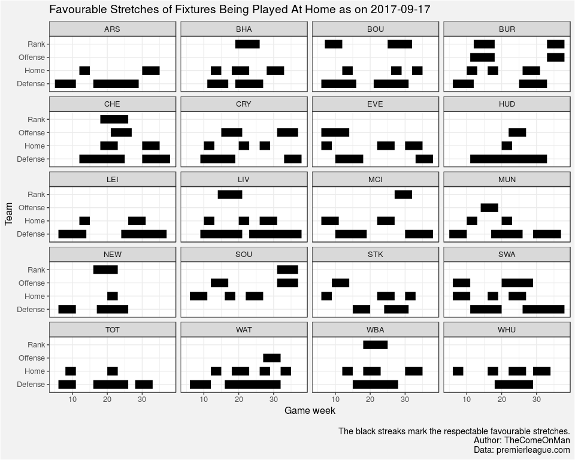

Compared to identfying teams that are performing well, it's a pain to
identify stretches of appealing fixtures. The coloured indicators for
match difficulty that FPL tacked on in 2016-17 don't seem to update with
performances. The charts uses only the EPL data to try and highlight
four aspects that one would typically look at when trying to decide
transfers. The thresholds, etc. aren't some sort of recommendation. Feel
free to change them if some other number makes more sense.

PS1: I might update this every week or not.

PS2: I think this code should be okay with double gameweeks. If it
isn't, I'll try and fix it at the earliest.

