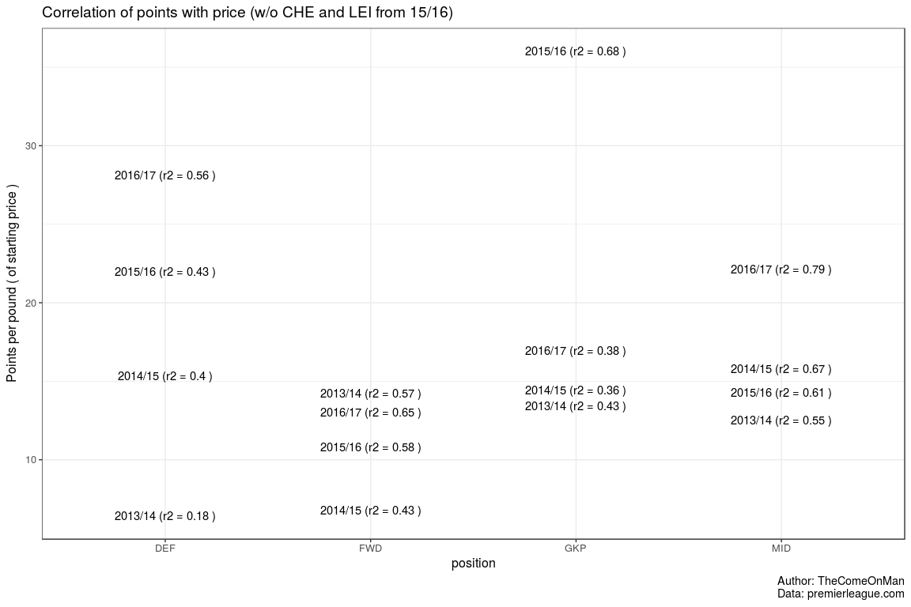
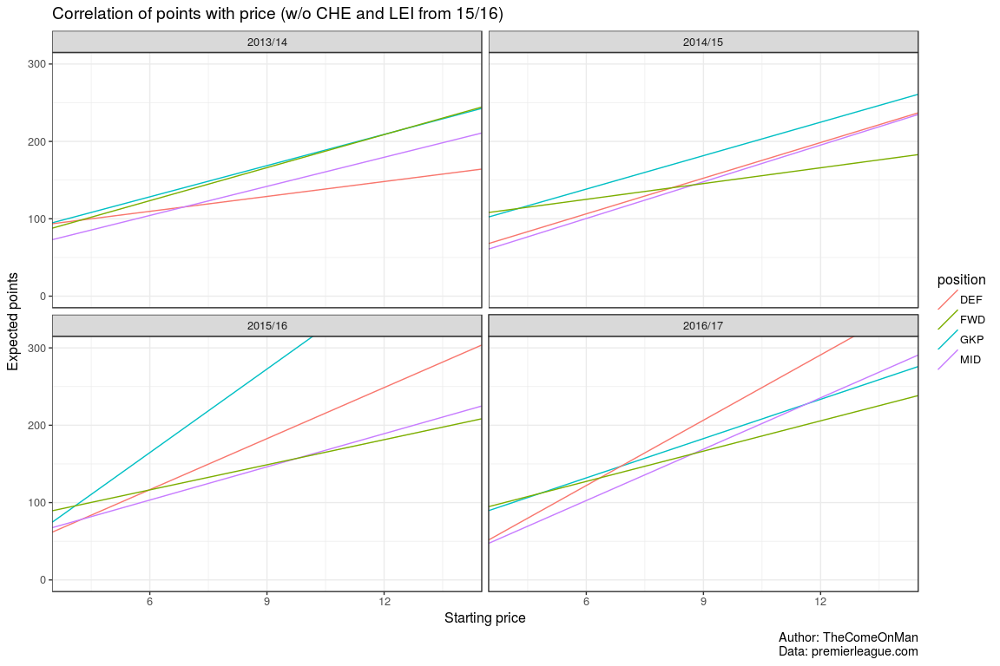
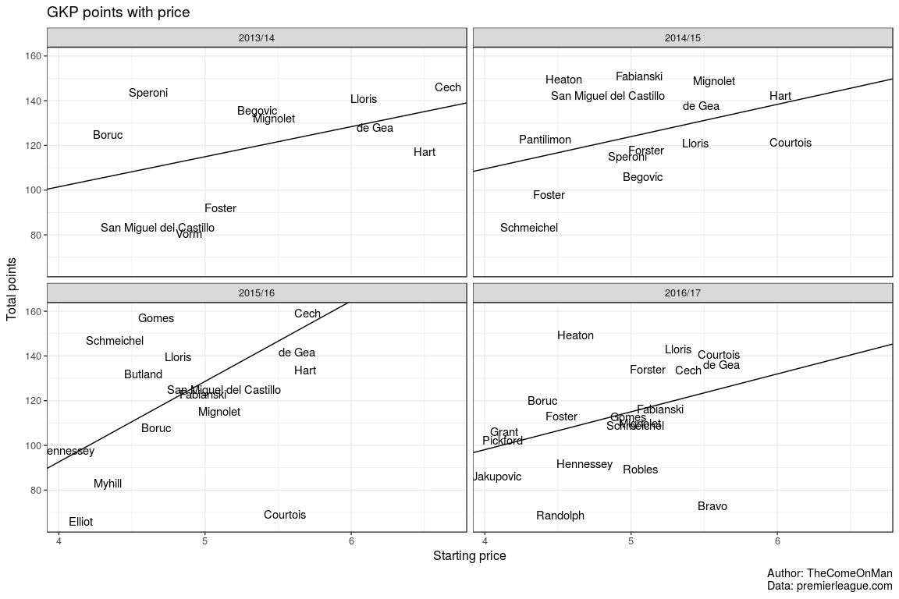
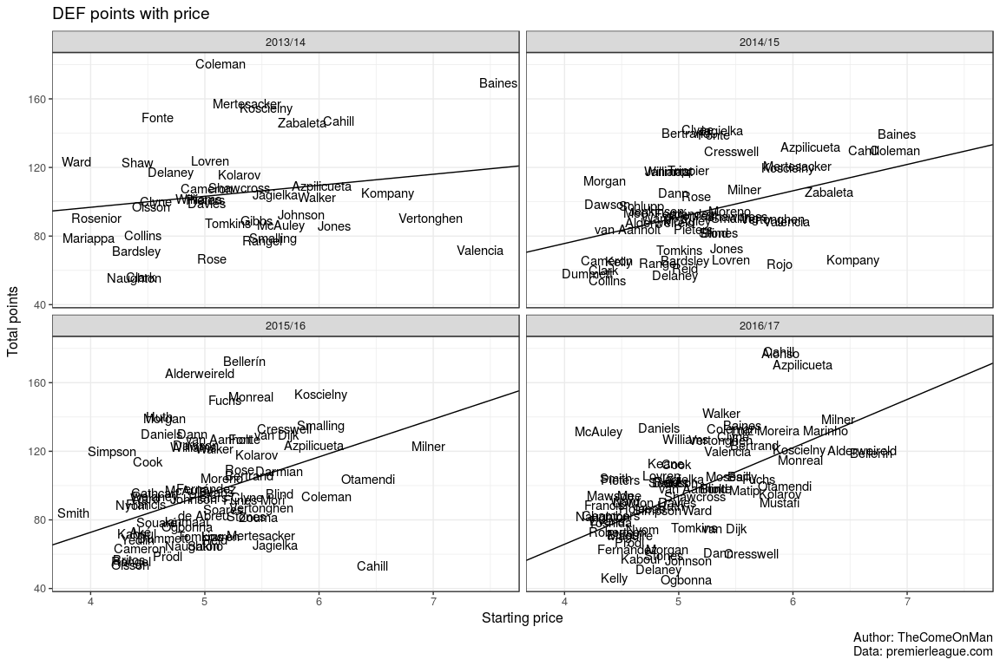
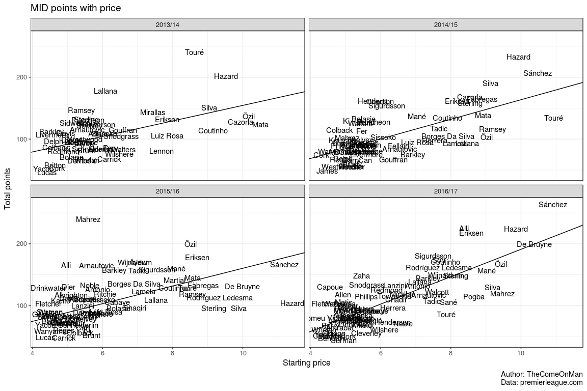
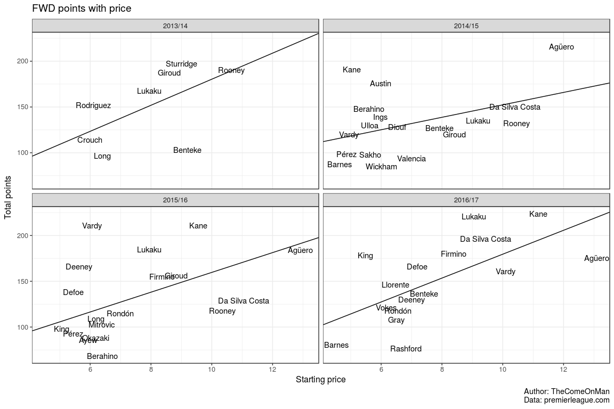

There has been a lot of talk about defenders being better value for
money than midfielders and forwards. I'd written a post about [the
optimal team
configuration](http://thecomeonman.blogspot.com/2014/08/fantasy-football-1-team-composition.html)
a long time ago and since it was only one season of data, I thought I'd
just check it again.

Assumptions 1:

-   I removed Chelsea and Leicester from 15/16 because of how unlikely
    both their performances were. Sure, there are swings in the table
    but those two teams in that season was a little too much. I feel the
    results are more representative without them.
-   Points per match is probably a better metric than total points but
    the historic data doesn't have a mention of matches started so we'll
    have to make do with total points. To minimise the effect, I have
    taken players that played at least 1710 minutes ( 19 matches of 90
    minutes ) and hope that the patterns observed also extend to all the
    players put together.
-   The data exposed is only for players active in the current season.
    This means that players who played in earlier seasons but have since
    left the EPL are not considered in the analysis for their
    respective seasons.
-   Players get their positions changed over seasons. This is too small
    in number to worry about.

### Value for money by position

If you force a linear relation between price and total points,
goalkeepers, midfielders and forwards seem pretty tight together at
about 15 points per pound, 15 points per pound, and 12 points per pound
respectively. Defense, interestingly, seems to be rising every year with
the last two years being well clear of the other positions. However the
r-square values seem to be much better for midfielders and forwards
indicating that the trend is more reliable for them than defenders or
goalkepers.

In the last season, considering defenders offered much better value per
pound of starting cost than the other positions, it seems it would make
sense to pick expensive defenders and then pick cheaper players in the
other positions. But since the trend in the value per pound is
unreliable, maybe it is safer to pick more midfielders and forwards?

You can poke around in the following charts which offer a more detailed
view into the data. The trends are drawn without the Chelsea and
Leicester players from 15/16 even though they appear on the charts.

Assumptions 2:

-   Picking one static team at the start of the season which stays
    throughout the year.
-   No captaincy concept.
-   18m set aside for substitutes, which means I can select a team
    costing 82m at most.
-   Players get their positions changed over seasons but for my
    convenience, I'm going to ignore that this happens.

### Optimal team configs

What we care about eventually though is the points total so I tried to
find the best team I could have picked. I then removed all the players
who figure in the best team from the dataset, and picked the next best
team. I picked a total of 5 teams like this.

<table style="width:100%;">
<colgroup>
<col width="6%" />
<col width="24%" />
<col width="23%" />
<col width="23%" />
<col width="23%" />
</colgroup>
<thead>
<tr class="header">
<th align="center">Itern</th>
<th align="center">DEF</th>
<th align="center">FWD</th>
<th align="center">GKP</th>
<th align="center">MID</th>
</tr>
</thead>
<tbody>
<tr class="odd">
<td align="center">1</td>
<td align="center">Kyle Walker (26ppp @5.5),  Gary Cahill (30ppp @6),  Marcos Alonso (30ppp @6)</td>
<td align="center">Romelu Lukaku (25ppp @9),  Joshua King (32ppp @5.5)</td>
<td align="center">Tom Heaton (33ppp @4.5)</td>
<td align="center">Alexis Sánchez (24ppp @11),  Gylfi Sigurdsson (24ppp @7.5),  Christian Eriksen (26ppp @8.5),  Bamidele Alli (26ppp @8.5),  Eden Hazard (22ppp @10)</td>
</tr>
<tr class="even">
<td align="center">2</td>
<td align="center">Gareth McAuley (29ppp @4.5),  César Azpilicueta (28ppp @6),  Leighton Baines (25ppp @5.5)</td>
<td align="center">Roberto Firmino (21ppp @8.5),  Harry Kane (20ppp @11),  Diego Da Silva Costa (21ppp @9.5)</td>
<td align="center">Hugo Lloris (26ppp @5.5)</td>
<td align="center">Philippe Coutinho (21ppp @8),  Kevin De Bruyne (19ppp @10.5),  Heung-Min Son (23ppp @7.5),  Wilfried Zaha (27ppp @5.5)</td>
</tr>
<tr class="odd">
<td align="center">3</td>
<td align="center">James Milner (21ppp @6.5),  Charlie Daniels (27ppp @5),  Seamus Coleman (24ppp @5.5)</td>
<td align="center">Sergio Agüero (13ppp @13),  Fernando Llorente (22ppp @6.5),  Jermain Defoe (24ppp @7)</td>
<td align="center">Thibaut Courtois (26ppp @5.5)</td>
<td align="center">Mesut Özil (18ppp @9.5),  Georginio Wijnaldum (19ppp @8),  Raheem Sterling (19ppp @8),  Pedro Rodríguez Ledesma (22ppp @7.5)</td>
</tr>
<tr class="even">
<td align="center">4</td>
<td align="center">Nathaniel Clyne (23ppp @5.5),  David Luiz Moreira Marinho (22ppp @6),  Ashley Williams (25ppp @5)</td>
<td align="center">Christian Benteke (18ppp @7.5),  Jamie Vardy (16ppp @10)</td>
<td align="center">David de Gea (25ppp @5.5)</td>
<td align="center">Adam Lallana (20ppp @7),  Sadio Mané (17ppp @9),  Robert Snodgrass (24ppp @5.5),  Manuel Lanzini (20ppp @6.5),  Ross Barkley (19ppp @7.5)</td>
</tr>
<tr class="odd">
<td align="center">5</td>
<td align="center">Laurent Koscielny (20ppp @6),  Ryan Bertrand (22ppp @5.5),  Jan Vertonghen (23ppp @5.5)</td>
<td align="center">Troy Deeney (19ppp @7),  Sam Vokes (20ppp @6)</td>
<td align="center">Fraser Forster (27ppp @5)</td>
<td align="center">Theo Walcott (16ppp @7.5),  David Silva (14ppp @9),  Nathan Redmond (21ppp @6),  Etienne Capoue (29ppp @4.5),  Michail Antonio (19ppp @7)</td>
</tr>
</tbody>
</table>

<table>
<colgroup>
<col width="5%" />
<col width="9%" />
<col width="10%" />
<col width="10%" />
<col width="10%" />
<col width="10%" />
<col width="10%" />
<col width="8%" />
<col width="8%" />
<col width="8%" />
<col width="8%" />
</colgroup>
<thead>
<tr class="header">
<th align="center">Itern</th>
<th align="center">start_cost</th>
<th align="center">total_points</th>
<th align="center">DEF avg cost</th>
<th align="center">FWD avg cost</th>
<th align="center">GKP avg cost</th>
<th align="center">MID avg cost</th>
<th align="center">DEF count</th>
<th align="center">FWD count</th>
<th align="center">GKP count</th>
<th align="center">MID count</th>
</tr>
</thead>
<tbody>
<tr class="odd">
<td align="center">1</td>
<td align="center">82</td>
<td align="center">2157</td>
<td align="center">5.8</td>
<td align="center">7.2</td>
<td align="center">4.5</td>
<td align="center">9.1</td>
<td align="center">3</td>
<td align="center">2</td>
<td align="center">1</td>
<td align="center">5</td>
</tr>
<tr class="even">
<td align="center">2</td>
<td align="center">82</td>
<td align="center">1872</td>
<td align="center">5.3</td>
<td align="center">9.7</td>
<td align="center">5.5</td>
<td align="center">7.9</td>
<td align="center">3</td>
<td align="center">3</td>
<td align="center">1</td>
<td align="center">4</td>
</tr>
<tr class="odd">
<td align="center">3</td>
<td align="center">82</td>
<td align="center">1661</td>
<td align="center">5.7</td>
<td align="center">8.8</td>
<td align="center">5.5</td>
<td align="center">8.2</td>
<td align="center">3</td>
<td align="center">3</td>
<td align="center">1</td>
<td align="center">4</td>
</tr>
<tr class="even">
<td align="center">4</td>
<td align="center">75</td>
<td align="center">1526</td>
<td align="center">5.5</td>
<td align="center">8.8</td>
<td align="center">5.5</td>
<td align="center">7.1</td>
<td align="center">3</td>
<td align="center">2</td>
<td align="center">1</td>
<td align="center">5</td>
</tr>
<tr class="odd">
<td align="center">5</td>
<td align="center">69</td>
<td align="center">1396</td>
<td align="center">5.7</td>
<td align="center">6.5</td>
<td align="center">5</td>
<td align="center">6.8</td>
<td align="center">3</td>
<td align="center">2</td>
<td align="center">1</td>
<td align="center">5</td>
</tr>
</tbody>
</table>

All the teams had 3 at the back but the combination seems to consist of
premium defenders and at least one of the midfielders or forwards being
a mid/low-budget option who is punching above his weight. It isn't easy
to spot these low cost - high points players so being realistic, what if
we remove some of the exceptional performers? I pick exceptional players
as players at least 30 points above what the earlier linear regression
predicts for their starting price.

<table>
<colgroup>
<col width="6%" />
<col width="23%" />
<col width="23%" />
<col width="23%" />
<col width="23%" />
</colgroup>
<thead>
<tr class="header">
<th align="center">Itern</th>
<th align="center">DEF</th>
<th align="center">FWD</th>
<th align="center">GKP</th>
<th align="center">MID</th>
</tr>
</thead>
<tbody>
<tr class="odd">
<td align="center">1</td>
<td align="center">James Milner (21ppp @6.5),  Leighton Baines (25ppp @5.5),  Seamus Coleman (24ppp @5.5)</td>
<td align="center">Roberto Firmino (21ppp @8.5),  Jermain Defoe (24ppp @7),  Diego Da Silva Costa (21ppp @9.5)</td>
<td align="center">Hugo Lloris (26ppp @5.5)</td>
<td align="center">Philippe Coutinho (21ppp @8),  Raheem Sterling (19ppp @8),  Kevin De Bruyne (19ppp @10.5),  Pedro Rodríguez Ledesma (22ppp @7.5)</td>
</tr>
<tr class="even">
<td align="center">2</td>
<td align="center">Nathaniel Clyne (23ppp @5.5),  Jan Vertonghen (23ppp @5.5),  David Luiz Moreira Marinho (22ppp @6)</td>
<td align="center">Sergio Agüero (13ppp @13),  Fernando Llorente (22ppp @6.5)</td>
<td align="center">Thibaut Courtois (26ppp @5.5)</td>
<td align="center">Mesut Özil (18ppp @9.5),  Sadio Mané (17ppp @9),  Georginio Wijnaldum (19ppp @8),  Nathan Redmond (21ppp @6),  Ross Barkley (19ppp @7.5)</td>
</tr>
<tr class="odd">
<td align="center">3</td>
<td align="center">Laurent Koscielny (20ppp @6),  Ryan Bertrand (22ppp @5.5),  Toby Alderweireld (18ppp @6.5)</td>
<td align="center">Troy Deeney (19ppp @7),  Christian Benteke (18ppp @7.5),  Jamie Vardy (16ppp @10)</td>
<td align="center">David de Gea (25ppp @5.5)</td>
<td align="center">Adam Lallana (20ppp @7),  David Silva (14ppp @9),  Manuel Lanzini (20ppp @6.5),  Michail Antonio (19ppp @7)</td>
</tr>
<tr class="even">
<td align="center">4</td>
<td align="center">Héctor Bellerín (18ppp @6.5),  Nacho Monreal (19ppp @6),  Antonio Valencia (22ppp @5.5)</td>
<td align="center">Salomón Rondón (18ppp @6.5),  Sam Vokes (20ppp @6)</td>
<td align="center">Fraser Forster (27ppp @5)</td>
<td align="center">Theo Walcott (16ppp @7.5),  Marko Arnautovic (16ppp @7.5),  Cesc Fàbregas (16ppp @7.5),  Kevin Mirallas (18ppp @6.5),  Riyad Mahrez (13ppp @9.5)</td>
</tr>
<tr class="odd">
<td align="center">5</td>
<td align="center">Dejan Lovren (21ppp @5),  Steve Cook (22ppp @5),  Michael Keane (23ppp @5)</td>
<td align="center">Olivier Giroud (13ppp @9),  Andre Gray (17ppp @6.5)</td>
<td align="center">Petr Cech (24ppp @5.5)</td>
<td align="center">Paul Pogba (14ppp @8.5),  Nacer Chadli (17ppp @6.5),  Matt Phillips (21ppp @5.5),  Willian Borges Da Silva (15ppp @7.5),  Andros Townsend (18ppp @6.5)</td>
</tr>
</tbody>
</table>

<table>
<colgroup>
<col width="5%" />
<col width="9%" />
<col width="10%" />
<col width="10%" />
<col width="10%" />
<col width="10%" />
<col width="10%" />
<col width="8%" />
<col width="8%" />
<col width="8%" />
<col width="8%" />
</colgroup>
<thead>
<tr class="header">
<th align="center">Itern</th>
<th align="center">start_cost</th>
<th align="center">total_points</th>
<th align="center">DEF avg cost</th>
<th align="center">FWD avg cost</th>
<th align="center">GKP avg cost</th>
<th align="center">MID avg cost</th>
<th align="center">DEF count</th>
<th align="center">FWD count</th>
<th align="center">GKP count</th>
<th align="center">MID count</th>
</tr>
</thead>
<tbody>
<tr class="odd">
<td align="center">1</td>
<td align="center">82</td>
<td align="center">1773</td>
<td align="center">5.8</td>
<td align="center">8.3</td>
<td align="center">5.5</td>
<td align="center">8.5</td>
<td align="center">3</td>
<td align="center">3</td>
<td align="center">1</td>
<td align="center">4</td>
</tr>
<tr class="even">
<td align="center">2</td>
<td align="center">82</td>
<td align="center">1591</td>
<td align="center">5.7</td>
<td align="center">9.8</td>
<td align="center">5.5</td>
<td align="center">8</td>
<td align="center">3</td>
<td align="center">2</td>
<td align="center">1</td>
<td align="center">5</td>
</tr>
<tr class="odd">
<td align="center">3</td>
<td align="center">77.5</td>
<td align="center">1461</td>
<td align="center">6</td>
<td align="center">8.2</td>
<td align="center">5.5</td>
<td align="center">7.4</td>
<td align="center">3</td>
<td align="center">3</td>
<td align="center">1</td>
<td align="center">4</td>
</tr>
<tr class="even">
<td align="center">4</td>
<td align="center">74</td>
<td align="center">1326</td>
<td align="center">6</td>
<td align="center">6.2</td>
<td align="center">5</td>
<td align="center">7.7</td>
<td align="center">3</td>
<td align="center">2</td>
<td align="center">1</td>
<td align="center">5</td>
</tr>
<tr class="odd">
<td align="center">5</td>
<td align="center">70.5</td>
<td align="center">1259</td>
<td align="center">5</td>
<td align="center">7.8</td>
<td align="center">5.5</td>
<td align="center">6.9</td>
<td align="center">3</td>
<td align="center">2</td>
<td align="center">1</td>
<td align="center">5</td>
</tr>
</tbody>
</table>

It's still 3 at the back except the defenders seem to be the more
expensive ones. Note that quite a few of the premium players have also
gotten omitted suggesting that the winning teams comprise of exceptional
performers at all price brackets and not just the mid and low price
brackets.

### Conclusion

Even if defenders offer better value for money, it still makes sense to
go for 3 at the back.
